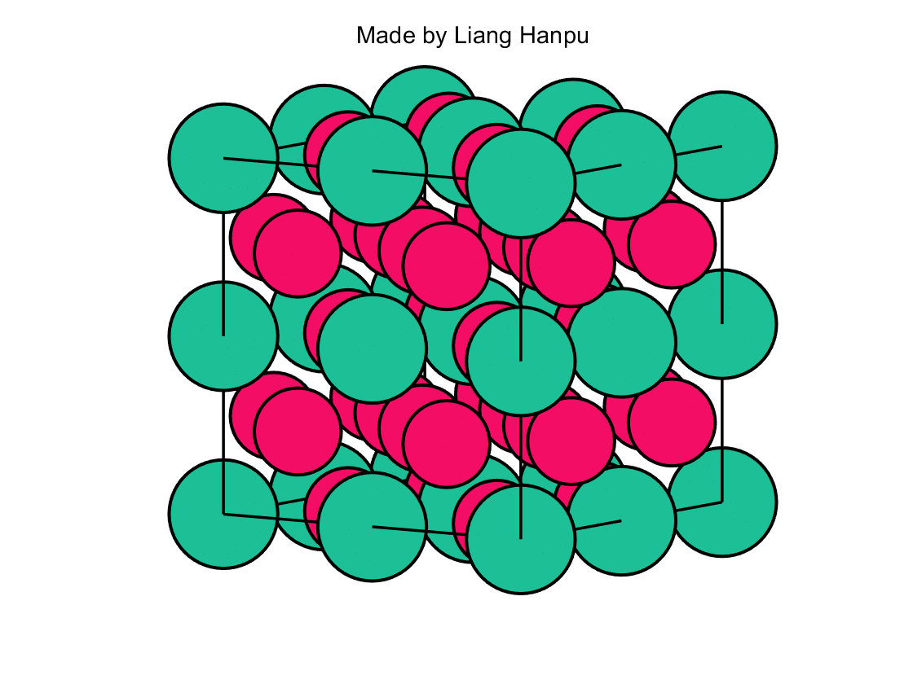
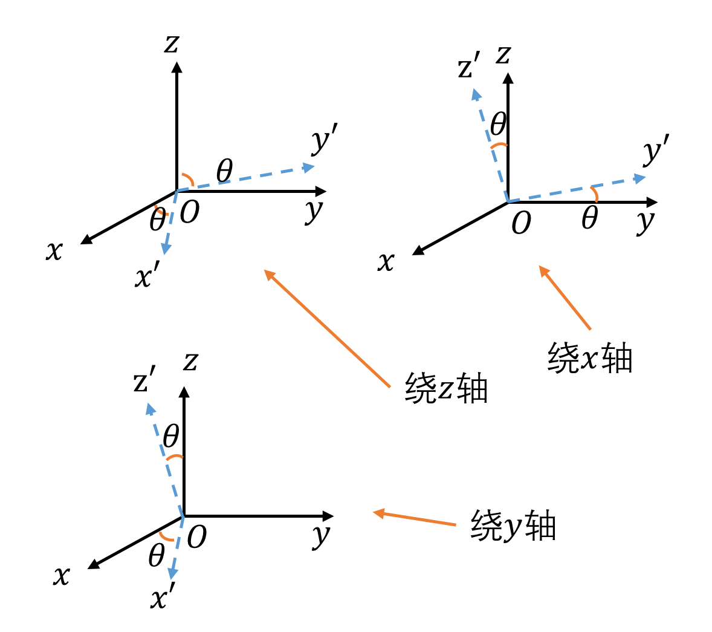

# 写的一些小程序

## 所需软件

MATLAB较近版本。笔者本人用的是MATLAB R2018a。

Python为3.6.1。

## 编码

文件内所有中文编码为utf-8。

## 运行

一般来说，MATLAB和Python都运行主函数即可，具体根据不同的程序决定。

## 简介

该库用来保存一些比较简单的小代码，通常可以在一个文件内写完，量级较小。

目前已有：

### MATLAB做晶体结构图

摘要：最近在复习考研复试《固体物理》这一门课，去年学的内容已经忘干净了，所以就翻开前几页。突然看到了面心立方和体心立方结构图，想到了去年室友用Mathematica做了晶胞的结构图，于是就手痒痒自己也想来做一个。具体物理内容不会涉及到多少，但还是要求大家能对“简单立方结构”、“体心立方结构”、“面心立方结构”有一个简单的理解，因为我比较懒，所以我就不放这些基础内容凑字数了。

### 坐标变换系列

摘要：前几日固体物理老师讲了一大堆关于坐标变换的内容，听的也是稀里糊涂。又和同学讨论了一下如果一个物体围绕坐标系中任意轴进行旋转，那么该如何计算其的旋转矩阵？于是思考了一会我就想出了一个自认为比较完善的方法，那就是将一个复杂的旋转操作拆分成几步基础旋转操作，然后依次写出旋转矩阵后按照顺序相乘即可。其实这也是一种比较常见的做法，但因为是自己探索到的，所以就对此比较上心，为了能够将其表现得更加形象直观，我也决定利用MATLAB和Python将其实现。

