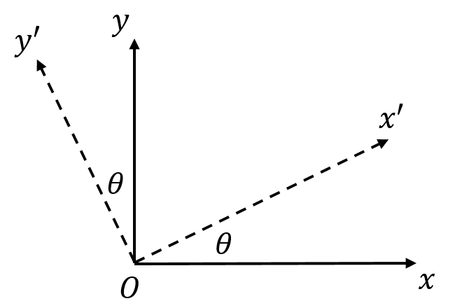
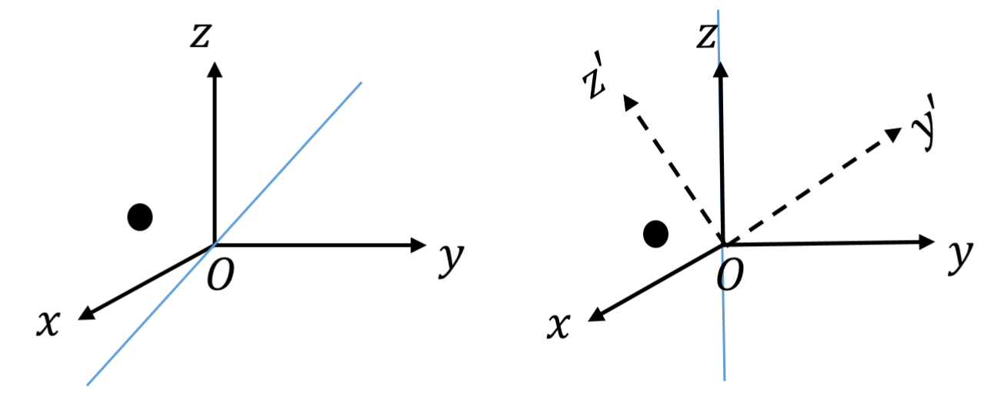
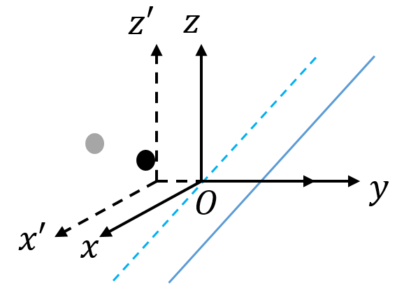

# 关于在坐标系中旋转平移物体的理论基础解析

## 写在前面

前几日固体物理老师讲了一大堆关于坐标变换的内容，听的也是稀里糊涂。又和同学讨论了一下如果一个物体围绕坐标系中任意轴进行旋转，那么该如何计算其的旋转矩阵？于是思考了一会我就想出了一个自认为比较完善的方法，那就是将一个复杂的旋转操作拆分成几步基础旋转操作，然后依次写出旋转矩阵后按照顺序相乘即可。

其实这也是一种比较常见的做法，但因为是自己探索到的，所以就对此比较上心，为了能够将其表现得更加形象直观，我也决定利用MATLAB和Python将其实现。

## 旋转矩阵的理论解释

因为这一段公式可能会比较多，所以我就直接放截图了，这样子也比较方便。

以上我们得到了三个旋转矩阵，分别是绕x轴旋转，绕y轴旋转，绕z轴旋转，下面我们开始定义操作。

## 定义旋转操作

### 旋转单次

**我们定义**：

- 绕x轴旋转为操作A;
- 绕y轴旋转为操作B;
- 绕z轴旋转为操作C。

如果一个物体R想要绕x轴旋转t角度，得到一个新的物体位置R'，我们可以写为

R' = A(t)R

其中R与R'就是坐标向量，A与R之间是向量乘法，A(t)代表的是绕x轴转角度t。

当然，一个物体不可能只有一个坐标点，如果存在多个坐标点R1,R2,R3，那么就一一乘上A(t)即可，也就是R1'=A(t)R1, R2'=A(t)R2, R3'=A(t)R3，最后得到新的物体的三个坐标点R1', R2', R3'。

### 连续多次旋转

如果我们想让这个物体首先绕x轴旋转角度t1，然后再绕y轴旋转角度t2，再绕z轴旋转角度t3，那么我们该怎么写？

我们一步一步看，首先是绕x轴旋转角度t1，公式为R'=A(t1)R。此时旋转后的物体的坐标是R'。

然后是绕y轴旋转角度t2，公式为R''=B(t2)R'。此时旋转后的物体的坐标是R''。

最后是绕z轴旋转角度r3，公式为R'''=C(t3)R''。此时旋转后的物体的坐标是R'''。

也就是说后一个操作是对当前物体的坐标进行操作。

那么我们两个两个看，联立前两个，先绕x轴t1角度再绕y轴t2角度，公式为R''=B(t2)R'=B(t2)A(t1)R。从公式中看这两步操作实际上是对R乘了两个矩阵B(t2)和A(t1)，这样就变成了R''。

注意，操作按照先后次序，右边的矩阵为先操作，左边的矩阵为后操作。

那么同理我们可以得到旋转三次后的坐标R'''=C(t3)B(t2)A(t1)R。

同理，**如果存在多次操作，我们只需要按照顺序不断的左乘旋转矩阵就好**。

## 进阶操作

### 不绕xyz轴旋转，过原点绕任意轴进行多次旋转

如图，我们要将物体绕着直线z=y按右手方向旋转30度，这种情况就相对比较复杂了，因为它并不是xyz轴，所以我们旋转时有以下三步操作：

- 将坐标系进行旋转操作，令$z=y$与原z轴重合，原z轴操作后的位置为z'轴；

- 将物体绕z轴按右手方向旋转30度；

- 将坐标系进行旋转操作，令z'轴与原z轴重合。

正如上图，左边为原坐标系，右边为绕x轴旋转45度后的新坐标系，其中旋转过后的坐标系为xy'z'，我们想要绕着转的直线（原z=y）现在变成了z轴，那么这样子就变成了绕z轴旋转的情况。

所以我们将绕x轴旋转坐标系的操作记为A(45)，所以物体现在的坐标为$R'=A(45)R$。

之后我们就可以将物体绕z轴右手方向旋转30度了，操作记为B(30)，所以现在物体的坐标为$R''=B(30)R'$。

但是此时我们的坐标系还是以原z=y为z轴的坐标系，我们需要把z'轴转过来，变成最初的那个样子，所以我们需要把坐标系绕x轴旋转-45度，这样子z'就和z重合了，z=y也回到了原来的位置。

所以这一步操作记为A(-45)，物体现在的坐标为R'''=A(-45)R''。

最后总的来说，这个物体从最初的状态到最后的状态相当于进行了三步操作，乘上了三个矩阵，即R'''=A(-45)B(30)A(45)R.

### 围绕轴不经过原点的旋转-初级

上面的方法全部都要经过原点，但如果我们想要围着转的对称轴不经过原点呢？这就要多加一个操作了，那就是给坐标加上个某一个值，比如我有坐标向量(x, y, z)，想要向x轴平移1单位，那么新的坐标就变成了(x+1, y, z)，相当于进行了如下操作

(x', y', z') = (x, y, z) + (1, 0, 0)

所以我们这里定义一个新操作D(a,x)。其中a代表沿着位移方向的轴，方向只有三个，xyz。x代表的是唯一的距离，比如说上述操作就可以写为D(x,1)，总的公式为R'=R+D(x,1)。

### 围绕轴不经过原点的旋转-高级

我们现在要将一个物体R绕着z=y-1这条线为轴右手方向旋转30度。其实步骤依旧和上面一模一样，只不过将z=y-1转到z轴上更为麻烦了而已，主要分为以下步骤。

首先将z=y-1平移到经过原点，也就是将坐标轴向y方向平移-1个单位，即操作D(y,1)，平移后的物体坐标为R'=R+D(y,-1)。

然后就是之前举的例子了，我们直接可以写得(我用R2代替R''，以此类推)

R2=A(45)R'

R3=B(30)R2

R4=A(-45)R3

最后到了这里我们还得把z=y-1移到原来位置，也就是再加上一个D(y,1)操作，也就是

R5=R4+D(y,-1)
=A(-45)B(30)A(45)[R+D(y,-1)]+D(y,1)

这样子，我们就可以实现任何操作

## 总结

可以看出，我们最终达到实现任何操作的步骤为三步

1. 将我们想要旋转的轴通过旋转与平移操作将其与任一坐标轴重合；

2. 进行我们想要绕着旋转轴旋转的操作；

3. 将旋转轴通过旋转与平移操作移动到原来的位置。

并且我们的基础操作总共有4个，其中三个旋转一个平移，分别为：

- 绕x轴右手方向旋转t角度记为A(t);

- 绕y轴右手方向旋转t角度记为B(t);

- 绕z轴右手方向旋转t角度记为C(t);

- 沿某一轴(记为a轴)正方向平移x距离记为D(a, x)。

这样子我们得到的坐标就是我们实现了当前操作的坐标。

下一篇文章讲利用编程实现这些操作。